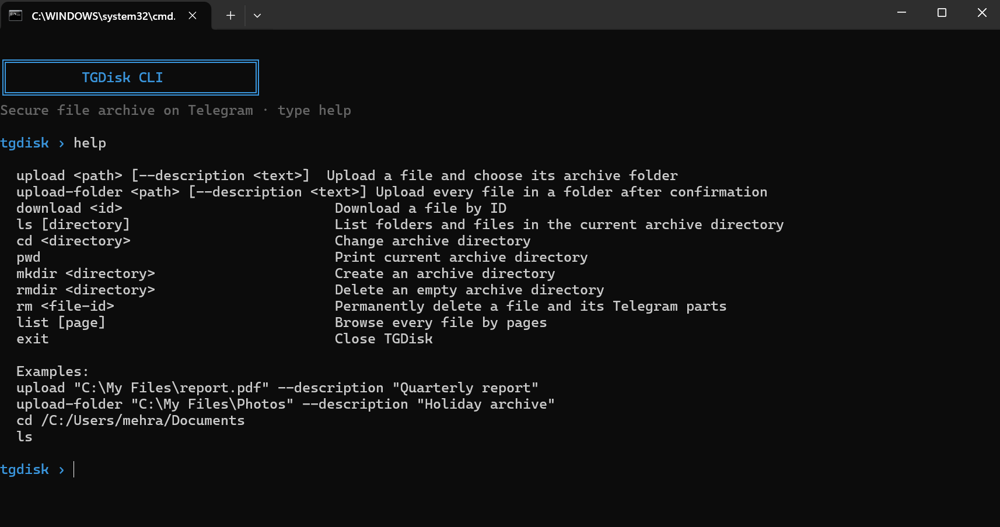

# TGDisk

TGDisk faylları Telegram-dakı **Saved Messages** bölməsində saxlayan komanda sətri arxividir. Fayllar lokal olaraq gzip ilə sıxılır, AES-256-GCM ilə şifrələnir və sonra Telegram sənədi kimi yüklənir. Şifrə kompüterinizdən kənara çıxmır.

Proqram kiçik virtual disk kimi işləyir: arxiv qovluqları yarada, `cd` ilə onlar arasında gəzə, `ls` ilə məzmunu görə, fayllara açıqlama əlavə edə, onları endirə və ya tam silə bilərsiniz. Virtual yollar, Telegram mesaj ID-ləri və sessiya lokal `db.json` faylında saxlanır.



> [!WARNING]
> `MASTER_PASSWORD` və `db.json` faylını təhlükəsiz saxlayın. Şifrə faylları açmaq üçün, `db.json` isə arxiv qeydlərini Telegram mesajları ilə əlaqələndirmək üçün lazımdır. Bunları açıq repozitoriyaya əlavə etməyin.

## Bir neçə kompüterdə istifadə

TGDisk arxiv indeksinin şifrələnmiş nüsxəsini Telegram-dakı Saved Messages bölməsində saxlayır. Eyni `.env` faylını ikinci kompüterə köçürün, TGDisk-i başladın, soruşulduqda eyni Telegram hesabına daxil olun və fayl siyahısı avtomatik bərpa ediləcək. Beləliklə, bir kompüterdə yüklənən fayllar digər kompüterdə siyahıda görünəcək və endirilə biləcək.

İkinci kompüterdən istifadə etməzdən əvvəl, arxivin olduğu kompüterdə TGDisk-in bu versiyasını bir dəfə başladın. Bu, mövcud lokal indeksi Telegram-a göndərir. İkinci kompüterdə `.env` faylı kifayətdir; `db.json`-u köçürmək lazım deyil. İlk dəfə Telegram-ın adi telefon kodu ilə girişini tamamlamalısınız; bundan sonra həmin kompüter öz lokal sessiyasını saxlayacaq. Eyni `MASTER_PASSWORD` istifadə olunmalıdır, çünki sinxron indeks və bütün arxiv faylları onunla şifrələnir. İkinci kompüterdə köhnə indeks qalıbsa və arxivdə dəyişiklik etməyə çalışarsa, TGDisk yeni məlumatın üzərinə yazmaq əvəzinə əməliyyatı dayandırır. Ən son indeksi yükləmək üçün proqramı yenidən başladın.

## İmkanlar

- Lokal gzip sıxılması və AES-256-GCM şifrələməsi.
- Fayl bərpa edilməzdən əvvəl təhlükəsiz autentifikasiya yoxlaması.
- Şifrələnmiş məlumat 200 MB-dan böyük olduqda avtomatik hissələrə bölünmə.
- `db.json` daxilində virtual arxiv qovluqları.
- Fayl açıqlamaları və səhifələnmiş ümumi arxiv siyahısı.
- Fayl axtarışı, metadata görünüşü və virtual qovluqlar arasında köçürmə.
- Təhlükəsiz silmə: fayllar təsdiq tələb edir və bütün Telegram hissələri silinir; qovluqlar yalnız boş olduqda silinə bilər.
- Səssiz Telegram qeydləri və oxunaqlı tərəqqi göstəriciləri.

## Tələblər

- Node.js 18 və ya daha yeni versiya.
- Telegram hesabı.
- Telegram API giriş məlumatları: `APP_ID` və `API_HASH`.

## Quraşdırma

1. Repozitoriyanı kopyalayın və qovluğa daxil olun:

   ```bash
   git clone https://github.com/mehrackerimov/tgdisk.git
   cd tgdisk
   ```

2. Asılılıqları quraşdırın:

   ```bash
   npm install
   ```

3. Lokal mühit faylını nümunədən yaradın:

   ```bash
   cp .env.example .env
   ```

   Windows PowerShell-də:

   ```powershell
   Copy-Item .env.example .env
   ```

4. `.env` faylını açıb hər üç dəyəri yazın:

   ```env
   MASTER_PASSWORD=uzun-ve-unikal-sifre-istifade-edin
   APP_ID=12345678
   API_HASH=sizin_telegram_api_hash
   ```

5. TGDisk-i başladın:

   ```bash
   node main.js
   ```

İlk açılışda TGDisk Telegram telefon nömrənizi və giriş kodunu soruşur. İki mərhələli doğrulama aktivdirsə, həmin şifrə də soruşulur. Telegram sessiyası `db.json`-da saxlanır; buna görə növbəti açılışlarda adətən yenidən giriş etməyə ehtiyac olmur.

## Telegram API məlumatlarını almaq

TGDisk bot tokenindən yox, Telegram-ın rəsmi müştəri API məlumatlarından istifadə edir.

1. Brauzerdə [my.telegram.org](https://my.telegram.org) səhifəsini açın.
2. İstifadə etmək istədiyiniz Telegram hesabının nömrəsi ilə daxil olun.
3. **API development tools** bölməsini seçin.
4. Yeni tətbiq yaradın. Məsələn, adı `TGDisk`, qısa adı isə `tgdisk` ola bilər.
5. Göstərilən **api_id** dəyərini `.env` içində `APP_ID`, **api_hash** dəyərini isə `API_HASH` kimi qeyd edin.

`API_HASH` şifrə kimi gizli məlumatdır. Onu paylaşmayın və versiya nəzarətinə əlavə etməyin.

## Əmrlər

Proqram daxilində `help` yazaraq əmrləri görə bilərsiniz.

| Əmr | Təsvir |
| --- | --- |
| `upload <path> [--description <text>]` | Faylı yükləyir və virtual arxiv qovluğunu soruşur. |
| `upload-folder <path> [--description <text>]` | Qovluğu rekursiv oxuyur, təsdiq istəyir və iyerarxiyanı saxlayaraq bütün faylları yükləyir. |
| `download <id>` | Faylı ümumi ID-si ilə bərpa edir. |
| `info <id>` | Bir arxiv faylının tam metadatasını göstərir. |
| `find <text>` | Fayl adlarında, açıqlamalarda və virtual yollarda axtarır. |
| `mv <file-id> <directory>` | Faylı başqa virtual arxiv qovluğuna köçürür. |
| `ls [directory]` | Cari arxiv qovluğundakı qovluq və faylları göstərir. |
| `cd <directory>` | Virtual qovluğu dəyişir. `.` və `..` dəstəklənir. |
| `pwd` | Cari virtual qovluğu göstərir. |
| `mkdir <directory>` | Çatışmayan ana qovluqları da yaradaraq virtual qovluq yaradır. |
| `rmdir <directory>` | Boş virtual qovluğu təsdiqdən sonra silir. |
| `rm <file-id>` | Arxiv faylını və Telegram-dakı bütün hissələrini həmişəlik silir. |
| `list [page]` | Bütün faylları 50-lik səhifələrlə göstərir. |
| `exit` | TGDisk-i bağlayır. |

### Nümunələr

Boşluqlu yol və açıqlama ilə fayl yükləmək:

```text
upload "C:\Users\me\Documents\Quarterly Report.pdf" --description "Q2 maliyyə hesabatı"
```

Təyinat qovluğu soruşulduqda cari virtual qovluğu seçmək üçün Enter basın. Arxivin kökündəsinizsə, Enter mənbə faylın kompüterdəki qovluğunu ilkin virtual yol kimi istifadə edir.

Arxivdə hərəkət etmək:

```text
mkdir projects
cd projects
upload "C:\work\demo.zip" --description "Demo quruluşu"
ls
pwd
```

Böyük arxivi səhifələrlə göstərmək:

```text
list 1
list 2
```

Mövcud faylları axtarmaq və nizamlamaq:

```text
find invoice
mv 3 /documents/2026
info 3
```

## UI üçün WebSocket rejimi

TGDisk eyni arxiv əmrlərini lokal WebSocket serveri vasitəsilə də təqdim edə bilər. Bu rejim gələcək masaüstü və ya veb interfeys üçündür. Server yalnız `127.0.0.1` ünvanına bağlandığı üçün standart olaraq digər cihazlardan əlçatan deyil.

```bash
npm run start:ws
# və ya öz portunuzu seçin:
node main.js --ws 9000
```

Standart port üçün `ws://127.0.0.1:8787` ünvanına qoşulun. Əmri JSON kimi göndərin:

```json
{ "type": "command", "id": "request-1", "command": "ls" }
```

Server yalnız `127.0.0.1` ünvanında dinləyir, mesaj ölçüsünü 64 KB ilə məhdudlaşdırır və `ready`, `event`, `prompt`, `result` mesajları göndərir. `prompt` təyinat qovluğu və silmə təsdiqi üçün istifadə olunur. Cavab olaraq `{ "type": "answer", "requestId": "...", "value": "..." }` göndərin. Nəticələr strukturlaşdırılmış JSON olduğuna görə UI qovluqları, faylları, tərəqqini və xətaları terminal çıxışını təhlil etmədən göstərə bilər. Arxiv verilənlər bazasını qorumaq üçün bütün əməliyyatlar qoşulmuş müştərilər arasında ardıcıl icra edilir. UI bağlantısı kəsilərsə və ya beş dəqiqə cavab verməzsə, təsdiq sorğusu qüvvədən düşür.

Brauzer əsaslı UI üçün serveri başlamazdan əvvəl `.env` faylında token təyin edin:

```env
TGDISK_WS_TOKEN=uzun-tesadufi-lokal-token
```

Token təyin edilərsə, müştəri `ready` mesajından sonra və əmrdən əvvəl `{ "type": "authenticate", "token": "..." }` göndərməlidir.

## Saxlama formatı və çoxhissəli fayllar

Hər yükləmə üçün TGDisk aşağıdakı şifrəli məlumat quruluşunu yaradır:

```text
12-bayt IV + gzip məlumatının AES-256-GCM şifrəli mətni + 16-bayt autentifikasiya teqi
```

Şifrələnmiş məlumat 200 MB-dan böyük olduqda ardıcıl Telegram sənədlərinə bölünür. `db.json` daxilindəki `parts` massivi hər hissənin sırasını, Telegram mesaj ID-sini və ölçüsünü saxlayır. Endirmə zamanı TGDisk hissələri sıra ilə alır, autentifikasiya teqini yoxlayır və yalnız uğurlu yoxlamadan sonra məlumatı açır.

## Məlumat faylları

- `.env` — lokal API məlumatları və şifrələmə parolu. Gizli saxlayın.
- `db.json` — arxiv metadatası, virtual fayl sistemi, Telegram mesaj ID-ləri və təkrar istifadə olunan sessiya. Təhlükəsiz ehtiyat nüsxəsini saxlayın.

Bu fayllar `.gitignore` vasitəsilə layihədən kənarda tutulur. `db.json`-un itməsi Telegram-dakı məlumatları silmir, lakin onları tapmaq və bərpa etmək üçün lazım olan lokal indeksi və sessiyanı itirir.

## Windows üçün icra faylı yaratmaq

TGDisk müstəqil Windows icra faylı kimi paketlənə bilər; bu halda istifadəçilərin Node.js quraşdırmasına ehtiyac olmur. Quruluş `@yao-pkg/pkg` paketinin 6.21.0 versiyası ilə gələn Node.js 24 Windows runtime-dan istifadə edir.

1. Asılılıqları quraşdırın:

   ```bash
   npm install
   ```

2. İcra faylını yaradın:

   ```bash
   npm run build:win
   ```

3. Fayl burada yaranacaq:

   ```text
   dist\tgdisk.exe
   ```

İlk istifadədən əvvəl `.env` faylını `tgdisk.exe` ilə eyni qovluğa yerləşdirin. Giriş etdikdən sonra TGDisk həmin qovluqda `db.json` yaradacaq. Bu fayl həm arxiv indeksini, həm də təkrar istifadə olunan sessiyanı ehtiva edir; onu məxfi saxlayın və ehtiyat nüsxəsini yaradın.

## Testlər

Avtomatik testləri işə salmaq üçün:

```bash
npm test
```

Testlər şifrələmə və autentifikasiyanı, çoxhissəli yükləmələrin sırasını, fayl bərpasını, dırnaqlı və boşluqlu yollardakı əmrləri, virtual fayl sistemi davranışını, silməni və WebSocket komanda sərhədini yoxlayır.

## Təhlükəsizlik qeydləri

- Uzun və unikal `MASTER_PASSWORD` istifadə edin, onu parol menecerində saxlayın.
- `db.json` daxilindəki şifrələnmiş qeydləri əl ilə dəyişdirməyin.
- TGDisk IV və autentifikasiya teqini saxlamazdan əvvəl yaradılmış köhnə arxiv qeydləri təhlükəsiz açılıb bərpa edilə bilməz. Onları yenidən yükləyin.
- Telegram hesabı və yaddaş limitləri yenə də qüvvədədir.
